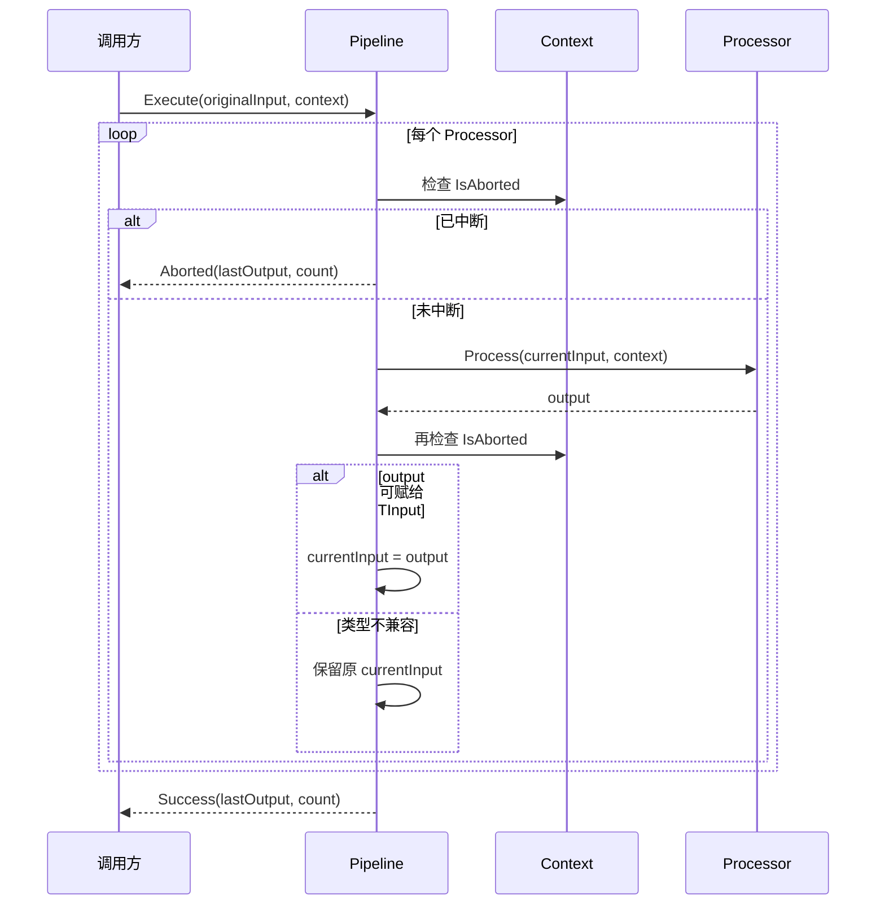
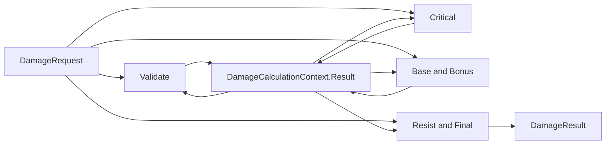

# Ability-Kit Dataflow：处理器链、异形结果传递与执行边界

> **阅读对象**：需要编写战斗计算、规则校验、数值修正或可组合处理流程的框架开发者。
>
> **文档目标**：以当前源码为准，说明处理器链、上下文槽位、同形/异形输入输出、结果状态和实例所有权；同时区分已实现能力、Samples 采用与尚未建立的测试证据。
>
> **当前成熟度：Runtime 局部 E3（契约测试）**。Dataflow 有 Unity package 与 .NET 镜像，`AbilityKit.Combat.Damage` 基于它实现伤害管线，`AbilityKit.Samples.Logic` 有两个真实调用；`AbilityKit.Dataflow.Tests` 的 `20/20` 与 `AbilityKit.Combat.Damage.Tests` 的 `5/5` 已覆盖本轮关键运行时契约。该结论不外推为 Unity 场景、生产主链路、性能预算或发布门禁。

---

## 一、设计理念：为什么需要 Dataflow 模块

Dataflow 模块用于把一段复杂计算拆成多个可组合的处理阶段。它适合表达“输入数据经过校验、修正、条件分支、中断判断，最终得到输出”的流程。

在战斗或技能系统中，常见问题是：

| 问题 | 表现 | Dataflow 的解决方式 |
|------|------|--------------------|
| 计算步骤散落 | 校验、修正、日志、打断逻辑混在一个函数里 | 通过 `IDataflowProcessor` 拆分为处理器 |
| 处理阶段难复用 | 同一段规则在不同技能中重复实现 | 处理器可以加入不同 Pipeline |
| 中间状态难传递 | 暴击、来源、临时参数需要跨阶段共享 | 通过 `IDataflowContext` 的 typed slot 或领域 Context 保存 |
| 错误和中断不统一 | 有的抛异常，有的返回特殊值 | 用 `DataflowResult` 和 `context.Abort()` 汇总最终状态 |

核心思想是：让业务计算沿着明确的处理器列表前进，每个处理器只关心当前输入、上下文和自己的输出。

---

## 二、模块边界

### 2.1 Dataflow 负责什么

- 定义数据处理器接口和抽象基类。
- 管理处理器链的添加、插入、移除和执行。
- 提供执行上下文，用于跨处理器共享临时数据。
- 封装成功、失败、中断三类执行结果。
- 提供常见处理器模板：校验、条件、打断、组合、日志。

### 2.2 Dataflow 不负责什么

- 不负责调度 Tick，也不维护时间。
- 不负责依赖注入、处理器创建、销毁或状态隔离。
- 不负责异步执行、线程切换、锁或并发调度。
- 不负责输入、输出、Context 或 Processor 的深拷贝。
- 不提供阶段级泛型类型链；一个 Pipeline 中所有 Processor 都共享同一组 `TInput/TOutput`。
- 不负责事务回滚、中断原因、阶段耗时或逐阶段 trace；Result 只保留最后完成输出与失败阶段身份。
- 不负责战斗领域规则本身，只提供组合骨架。

---

## 三、目录结构

| 路径 | 职责 |
|------|------|
| `Runtime/Core/Pipeline/DataflowPipeline.cs` | Pipeline 接口、泛型实现、Builder 和扩展入口 |
| `Runtime/Core/Pipeline/DataflowResult.cs` | 执行结果模型，表达成功、失败、中断 |
| `Runtime/Core/Context/IDataflowContext.cs` | 上下文接口 |
| `Runtime/Core/Context/DataflowContext.cs` | 上下文实现，保存 Source、Abort 状态和槽位 |
| `Runtime/Core/Context/DataflowSlots.cs` | typed slot 定义 |
| `Runtime/Core/Processor/IDataflowProcessor.cs` | 处理器接口与抽象基类 |
| `Runtime/Core/Processor/CommonProcessors.cs` | 常用处理器模板 |

---

## 四、核心类型与职责

### 4.1 DataflowPipeline<TInput, TOutput>

`DataflowPipeline<TInput, TOutput>` 是处理器链容器。内部使用 `List<IDataflowProcessor<TInput, TOutput>>` 保存处理阶段。Pipeline 自身不维护“本次执行”的独立状态，但会直接复用列表中的 Processor 实例，因此线程安全取决于 Processor 是否无状态以及调用方是否隔离 Context。

核心 API：

| API | 行为 |
|-----|------|
| `Execute(input, context)` | 顺序执行处理器，返回 `DataflowResult<TOutput>` |
| `AddProcessor` / `AddProcessors` | 追加处理器 |
| `InsertProcessor` | 按索引插入处理器 |
| `RemoveProcessor` | 删除指定索引处理器 |
| `Clear` | 清空处理器链 |
| `Clone` | 复制 Pipeline 结构，处理器实例仍为同一引用 |

执行时，如果 `context` 为 null，会创建新的 `DataflowContext`。执行开始会先检查预中止状态，再把处理器列表复制为当次快照；回调内追加或移除 Processor 不会改变本轮计划，但 `Add/Insert/Remove/Clear` 与 `Execute` 之间仍没有并发同步。如果没有处理器，当前实现返回 `Success(default, 0)`。

`AddProcessors` 采用“完整校验后提交”：数组本身或任一成员无效时不会部分追加。`Clone()` 与 Builder 的 `Build()` 都复制列表结构，因此构建后的 Pipeline 可独立增删阶段；复制仍是浅复制，Processor 实例共享。

### 4.2 IDataflowProcessor<TInput, TOutput>

处理器是 Pipeline 的最小执行单元：

```csharp
public interface IDataflowProcessor<TInput, TOutput>
{
    string Name { get; }
    TOutput Process(TInput input, IDataflowContext context);
}
```

抽象基类 `DataflowProcessor<TInput, TOutput>` 的固定顺序是 `OnBeforeProcess -> OnProcess -> OnAfterProcess`。任一 Hook 抛出的异常都会越过当前 Processor，由 Pipeline 捕获并转为 Failure；框架不会执行补偿 Hook。

### 4.3 IDataflowContext 与 DataflowContext

上下文承担三个职责：

- 保存 `Source`，用于记录本次流水线来源对象。
- 保存 `IsAborted`，处理器可以调用 `Abort()` 阻止后续阶段。
- 保存 typed slot，用于跨处理器传递临时数据。

`DataflowSlot<T>` 让调用 API 带上泛型，默认 Context 的底层键是 `(slot.Name, typeof(T))`。同名、同类型的不同 slot 实例可以互通，同名、不同类型的数据彼此隔离；该选择兼顾跨程序集共享声明与运行时类型安全，不要求所有消费者持有同一个 slot 对象。

`ContainsData(slot)` 使用同一 typed key。显式写入的 null 引用仍算“存在”，`TryGetData` 返回 true 且值为 null。slot 名称不能是 null、空串或纯空白；领域模块应继续使用稳定前缀避免语义碰撞。

`Clear()` 通过虚方法 `Reset()` 清理数据、Source 和 Abort 状态。派生 Context 重写 `Reset()` 后，从 `IDataflowContext.Clear()` 入口也会动态派发，因此对象池回收不会遗漏派生字段。

### 4.4 DataflowResult<T>

执行结果记录 `Output`、`ProcessedCount`、`IsAborted`、`Error`、`FailedProcessorIndex` 和 `FailedProcessorName`，其中 `IsSuccess` 等价于“未中断且无异常”。Pipeline 捕获 Processor 异常后返回 Failure，不继续向外抛出该异常。

Abort 会保留触发中止阶段的输出；Failure 会保留异常前最后一个完成阶段的输出，并记录抛错阶段身份。`ProcessedCount` 只计算完整返回的 Processor，抛错阶段不计数。Result 仍不是事务或完整 trace：部分输出可能对应已发生的 Context/外部副作用，中止原因、阶段耗时和补偿状态都不在模型中。

### 4.5 CommonProcessors

当前内置模板包括：

| 类型 | 职责 |
|------|------|
| `ValidatorProcessor<TInput>` | 校验输入，不通过时调用 `context.Abort()` 并返回默认值 |
| `ConditionalProcessor<TInput,TOutput>` | 根据条件选择 true/false 分支处理 |
| `InterruptProcessor<TInput,TOutput>` | 满足条件时中断 Pipeline，同时仍可执行转换 |
| `CompositeProcessor<TInput,TOutput>` | 组合多个处理器；兼容输出回灌给下一子项，异形输出不改变原 input |
| `LoggingProcessor<TInput>` | 输出输入和输出日志，默认写到 `Console.WriteLine` |

---

## 五、执行语义：同形回灌与异形结果



### 5.1 同形或兼容类型管线

源码使用模式匹配，而不是强制转换：

```csharp
if (output is TInput nextInput)
{
    input = nextInput;
}
```

当 `TInput == TOutput`，或运行时 output 同时实现/继承 `TInput` 时，输出才成为下一 Processor 的输入。若 output 为 null 或类型不兼容，下一阶段继续收到之前的 input，不抛类型转换异常。

这适合“同一模型逐步规范化”的流程。需要注意：框架不会复制 input；若 Processor 原地修改引用对象，即使返回值不回灌，后续阶段仍可能观察到同一对象的变更。

### 5.2 异形管线不是阶段泛型链

`DataflowPipeline<DamageRequest, DamageResult>` 是当前最重要的异形示例。所有 Damage Processor 的接口都是 `Process(DamageRequest, context) -> DamageResult`；由于 `DamageResult` 不能赋给 `DamageRequest`，每一阶段都继续收到原始 Request。



中间结果不是靠 Pipeline 的 input 回灌，而是靠每个 Damage Processor 在执行开始时从 `DamageCalculationContext.Result` 读取局部值，并由 `DamageProcessor.OnAfterProcess()` 写回，下一 Processor 再读取。`CritRoll` 由调用方写入 `DamageSlots.CritRoll`，避免 Processor 自行取随机数，这对纯逻辑测试、回放和确定性 sample 是正确方向。

这套设计的代价是领域 Processor 与特定 Context 形成隐式协议。若调用方只传普通 `DataflowContext`，每个 Damage Processor 都可能重新以 Request 创建结果，无法得到预期的累积计算。通用框架不会验证 Context 的具体类型。

### 5.3 Abort 与异常时序

Abort 在 Execute 开始、每次 Processor 开始前和 Processor 返回后检查。触发 `context.Abort()` 的 Processor 会正常返回、保留输出并计入 `ProcessedCount`，包括最后一个 Processor；预先中止的 Context 即使面对空 Pipeline 也返回 `Aborted(default, 0)`。

异常发生时，抛错 Processor 不计入 `ProcessedCount`；Failure 保留此前最后完成的 Output，并记录抛错 Processor 的快照索引和名称。Abort 和异常都没有事务回滚，Processor 对 input、Context 或外部对象已产生的副作用会保留。

---

## 六、实例所有权与线程边界

| 对象 | 推荐所有者 | 可否跨执行复用 | 当前风险 |
|------|------------|----------------|----------|
| Pipeline | 业务服务、Factory 或单次调用 | 仅在 Processor 无状态且列表不被并发修改时 | Add/Insert/Remove/Clear 与 Execute 无锁 |
| Processor | Pipeline 创建方 | 无状态实现可复用；有实例字段时应隔离 | 框架不提供生命周期和并发保护 |
| Context | 单次 Execute 或对象池租约 | Reset 后可串行复用 | 字典和 Abort 状态无锁，不可并发共享 |
| Input/Output | 调用方 | 由业务模型决定 | 框架不复制、不冻结、不回滚 |
| Clone 结果 | Clone 调用方 | 结构独立 | Processor 引用共享，不是深克隆 |

Damage Processor 不再持有跨调用 `_result` 字段，而是从本次 Context 取得局部 `DamageResult`。同一个只读 `DamageCalculationPipeline` 配合彼此隔离的 Context 可以并发 Execute，本轮专项测试覆盖 64 路调用结果隔离；这不代表任意自定义有状态 Processor、共享 Context 或执行中修改 Pipeline 都线程安全。

`DataflowPipelineBuilder.Build()` 返回结构浅快照。Build 后继续 Add/Insert 不会修改先前结果，但多个结果仍可能共享同一 Processor 引用；需要实例级状态时应由业务 Factory 创建独立 Processor。

---

## 七、扩展与最小接入

新增同形处理器时，优先继承 `DataflowProcessor<T>`；异形流程只有在每一阶段都接受同一个原始输入、并明确设计领域 Context 协议时才适用。不要把该 API 理解成可表达 `A -> B -> C` 的阶段类型图。

```csharp
public sealed class DamageValue
{
    public int Value;
}

public sealed class ClampDamageProcessor
    : DataflowProcessor<DamageValue, DamageValue>
{
    protected override DamageValue OnProcess(
        DamageValue input,
        IDataflowContext context)
    {
        input.Value = Math.Max(0, input.Value);
        return input;
    }
}

var pipeline = DataflowPipelineExtensions
    .NewPipeline<DamageValue, DamageValue>("Damage")
    .Add(new ClampDamageProcessor())
    .Build();

var context = new DataflowContext();
var result = pipeline.Execute(new DamageValue { Value = 100 }, context);
if (!result.IsSuccess)
{
    // 显式处理 result.IsAborted 与 result.Error。
}
```

业务 slot 应采用模块前缀和稳定含义，例如 `Damage_CritRoll`。日志处理器应重写 `Log()` 接入框架诊断；默认 `Console.WriteLine` 不应直接进入 Unity 或服务端热路径。

本轮删除了通用包中无人使用且越过模块边界的 `DataflowSlots.Damage`、`DataflowSlots.Heal` 和 `DataflowSlots.Common`。消费者应把声明迁移到所属领域，例如伤害模块使用 `DamageSlots`；这是一项源码级破坏性迁移，不能通过字符串名称兼容来掩盖旧 API 引用。

---

## 八、失败矩阵

| 场景 | 当前结果 | 调用方必须知道的边界 |
|------|----------|----------------------|
| Context 为 null | 自动创建普通 `DataflowContext` | 领域 Processor 依赖派生 Context 时可能静默降级 |
| Pipeline 为空 | `Success(default, 0)` | 成功不代表产生了有效输出 |
| Execute 前 Context 已 Abort | `Aborted(default, 0)` | 复用 Context 前必须 Reset |
| Processor 内 Abort | 返回 `Aborted(lastOutput, count)` | 当前 Processor 已执行并计数；副作用不回滚 |
| Processor 或 Hook 抛异常 | `Failure(exception, lastOutput, count, index, name)` | 抛错阶段不计数；输出是部分结果而非事务提交 |
| 同名不同类型 slot | `(name, type)` 隔离保存 | 同名同类型仍共享，名称语义由领域维护 |
| Composite 包含多个 Processor | 兼容输出回灌，异形输出保留原 input | 构造时复制数组，但子 Processor 引用共享 |
| Clone 后修改 Processor 内部状态 | 原 Pipeline 与 Clone 同时受影响 | Clone 只复制列表结构 |
| 并发 Execute 有状态 Processor | 数据竞争 | 框架不为自定义 Processor 或共享 Context 加锁 |
| Execute 回调内修改 Pipeline | 本轮使用开始时快照 | 修改影响后续执行；并发列表读写仍无同步承诺 |
| Processor 已修改外部状态后失败 | 返回 Failure | 无补偿、无事务回滚 |

---

## 九、采用证据与未覆盖范围

| 等级 | 当前证据 | 结论 |
|------|----------|------|
| E0 源码 | `com.abilitykit.dataflow/Runtime` 与 `src/AbilityKit.Dataflow` | Unity 与 .NET 共用 package Runtime 源码 |
| E1 示例 | `CombatDamagePipelineSample`、`CombatProjectileHitDamage` | Damage 异形管线在 Samples 有真实调用 |
| E2 生产接入 | 未发现 package 或 Server 业务主链路调用 | 不声明生产采用 |
| E3 自动测试 | `AbilityKit.Dataflow.Tests` `20/20`；`AbilityKit.Combat.Damage.Tests` `5/5` | 覆盖 Execute/Abort/Failure/snapshot、slot/Clear、Builder/Clone/Composite 与 Damage 八阶段/并发隔离 |
| E4 场景验收 | 未发现 Dataflow 专项 Smoke/Acceptance | Samples 输出不能替代场景门禁 |
| E5 发布门禁 | 未建立 | 无基线、预算或 CI 阻断声明 |

后续证据建议：

1. P0：增加 Unity package 编译与场景调用，验证 IL2CPP/Unity API 兼容及 package 元数据。
2. P1：补 null output、普通 Context 误用于 Damage、确定性 CritRoll 和自定义有状态 Processor 并发负例。
3. P1：明确 Pipeline 列表并发修改策略，必要时引入冻结态，而不是误把执行快照写成集合线程安全。
4. P2：建立阶段 trace、耗时和分配基线，再决定是否提升生产证据等级。

---

## 十、源码阅读路径

1. 从 `Runtime/Core/Pipeline/DataflowPipeline.cs` 阅读 Execute、列表修改、Clone 和 Builder。
2. 阅读 `Runtime/Core/Processor/IDataflowProcessor.cs`，确认三个 Hook 的异常边界。
3. 阅读 `Runtime/Core/Context/DataflowContext.cs` 与 `DataflowSlots.cs`，确认 typed key、默认值和 Reset 动态派发。
4. 阅读 `Runtime/Core/Processor/CommonProcessors.cs`，重点核对 Abort 与 Composite。
5. 阅读 `com.abilitykit.combat.damage/Runtime/Damage/Processor/DamageProcessors.cs` 和 `DamageCalculationContext.cs`，理解异形结果传递。
6. 阅读 `src/AbilityKit.Samples.Logic/Samples/Combat/CombatFirstWaveSamples.cs`，观察两个 E1 调用。
7. 阅读 `src/AbilityKit.Dataflow.Tests` 与 `src/AbilityKit.Combat.Damage.Tests/DamageCalculationPipelineTests.cs`，确认本轮契约证据。

---

## 十一、演进顺序

1. 明确 Processor 的无状态约束，评估 Pipeline 冻结态或显式执行计划，收敛配置期与执行期并发边界。
2. 为 Abort 增加可选原因，为 Result/diagnostics 增加阶段耗时与 trace，但不把它包装成事务语义。
3. 若需要真正的异形阶段链，新增显式 `A -> B -> C` 组合抽象，不改变现有 Damage Context 协议。
4. 评估 Damage 对普通 `DataflowContext` 的快速失败，避免领域累积协议被静默绕过。
5. 建立 Unity、真实消费者与性能门禁后，再把 Runtime 局部 E3 提升为更高成熟度。

---

*文档版本：3.0*
*最后更新：2026-08-17*
