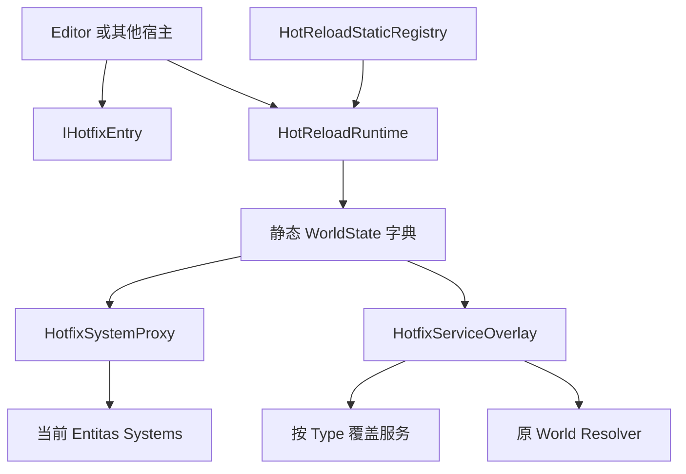
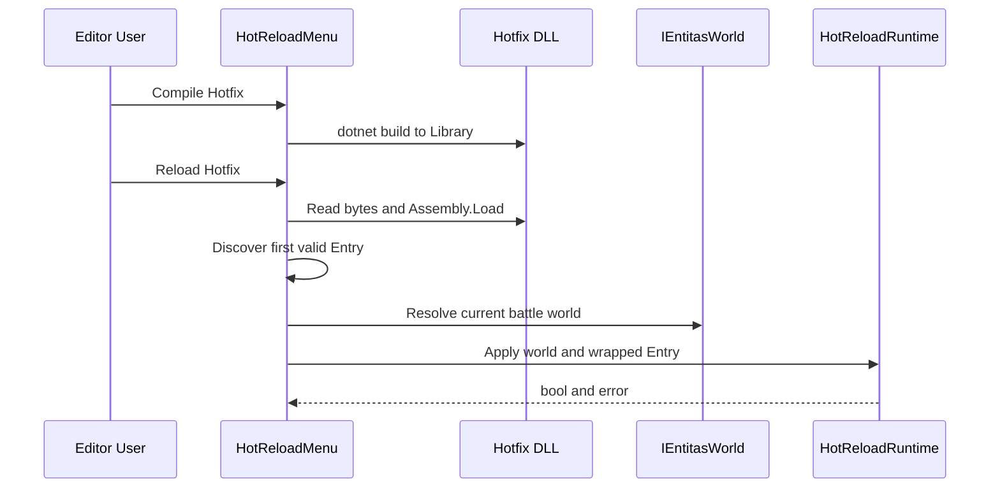
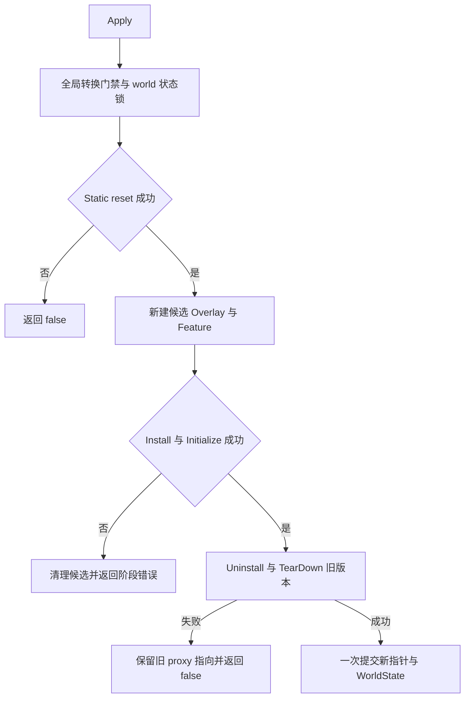

# Ability-Kit HotReload：Entitas 系统热替换、所有权与失败边界

> **阅读对象**：维护 MOBA Editor 热修复入口、实现 `IHotfixEntry`，或评估运行期系统替换风险的开发者。
>
> **文档目标**：以当前源码为准，解释 DLL 装载之外的运行时替换机制、世界级状态、服务覆盖、静态重置、失败语义与验证缺口。
>
> **成熟度**：Runtime 局部 E3，Editor 装载链 E1。`AbilityKit.HotReload.Tests` 已覆盖 13 项替换、失败、隔离和释放契约；仍没有 Unity 场景验收、程序集卸载、联机安全点或发布门禁。

---

## 一、能力定位与选型速查

HotReload 是一个面向 Entitas 世界的轻量替换内核。它把新程序集提供的 `IHotfixEntry` 安装到独立 `Entitas.Systems`，再由预先插入世界系统表的 `HotfixSystemProxy` 转发生命周期调用。业务可以通过 `HotfixServiceOverlay` 给热更层覆盖少量服务，而不修改原世界容器。

| 需求 | 当前支持 | 结论 |
|------|----------|------|
| 运行期替换一组 Entitas systems | 支持，由 Runtime 分阶段准备后提交给内部 proxy | 仅适合明确控制 Apply 安全点的调试或试验链路 |
| 从 DLL 发现并创建入口 | 包本身不负责；MOBA Editor 用反射实现 | 加载策略属于宿主，不是运行时内核保证 |
| 热更服务覆盖 | 支持按精确 `Type` 覆盖解析 | overlay 不拥有实例释放职责 |
| 静态状态重置 | 支持按稳定 id 注册、替换、移除和统一调用 | reset 失败会聚合并阻止本次 Apply，不再静默继续 |
| 配置热重载 | 仅有 Editor 日志监听器 | 与 DLL Apply 是两条独立链路，不是同一事务 |
| 候选失败隔离 | 支持 | 新 feature 在独立 overlay 中 Install/Initialize，失败不会提交给 proxy |
| 旧版本完整回滚 | 不支持 | 旧 Uninstall/TearDown 自身若部分执行后失败，框架无法逆转业务副作用 |
| 并发 Apply/Release | 单飞拒绝 | 全局门禁保护跨 world static reset，并发或重入立即失败；仍要求避开 Tick |
| 世界销毁后清理 | 支持 | `ReleaseWorld` 可显式释放；proxy 在 world TearDown 时也会自动触发释放 |

不应在以下场景直接采用当前实现：需要 HybridCLR/ILRuntime 平台装载、可卸载程序集、生产级灰度发布、失败后逆转任意业务副作用，或要求强确定性的联机战斗中途替换。跨 world 请求虽然会串行执行，但这只是状态安全边界，不代表高吞吐并发热更能力。

---

## 二、源码与工程入口

| 层次 | 入口 | 职责 |
|------|------|------|
| Unity package | `Unity/Packages/com.abilitykit.hotreload/Runtime/HotReload` | Entry、Proxy、Overlay、Static Registry 和日志接口 |
| .NET 镜像 | `src/AbilityKit.HotReload/AbilityKit.HotReload.csproj` | 编译 package Runtime；排除 Unity Editor 配置监听器 |
| Editor 宿主 | `Unity/Packages/com.abilitykit.demo.moba.editor/Editor/HotReload/HotReloadMenu.cs` | 编译 DLL、选择程序集、反射发现 Entry、定位当前世界并调用 Apply |
| 热更项目 | `Unity/HotUpdateSrc/Hotfix.Ability.Moba/Hotfix.Ability.Moba.csproj` | 面向 `netstandard2.1`，引用 Unity 生成的 HotReload、World DI 和 Entitas 程序集 |
| 示例 Entry | `Unity/HotUpdateSrc/Hotfix.Ability.Moba/MobaHotfixEntry.cs` | 安装每 60 Tick 记录一次日志的示例 System |

核心类型关系：

---

## 三、宿主装载链与 Entry 发现规则

HotReload package 不读取 DLL。当前唯一完整宿主在 MOBA Editor，其流程如下：

1. `Compile Hotfix` 执行 `dotnet build`，输出到 Unity 工程的 `Library/HotUpdate`。
2. `Reload Hotfix` 按最后写入时间选择名称匹配 `Hotfix.Ability.Moba*.dll` 的文件。
3. 宿主读取 DLL 和可选 PDB 字节，调用 `Assembly.Load`。当前没有程序集卸载上下文，重复加载会在进程中保留旧程序集。
4. 宿主按 `Assembly.GetTypes()` 返回顺序选择第一个非抽象、实现 `IHotfixEntry` 且有无参构造函数的类型。多个候选时没有显式优先级，也没有校验 `Name` 唯一性。
5. 宿主通过 `BattleLogicSessionHost.Current` 取得当前世界，并要求它实现 `IEntitasWorld`。
6. `EntryWithLogger` 在安装前向 overlay 写入 `IHotfixLogger`，然后把 Entry 交给 `HotReloadRuntime.Apply`。

因此，文件选择、程序集身份、Entry 选择和当前世界选择都属于 Editor 宿主策略。其他运行端若复用 Runtime，必须自行定义这些规则。

---

## 四、Apply 流程与提交边界

`HotReloadRuntime` 使用 `ConditionalWeakTable<IEntitasWorld, WorldState>` 按 world 对象身份隔离状态，不再以 `WorldId` 作为所有权键。相同或空 `WorldId` 的不同 world 不会共享 proxy、contexts、resolver 或当前 Entry。

一次 Apply 的顺序是：

1. 校验 world 和 entry，并尝试进入全局 Runtime 转换门禁；已有转换时立即失败，不在线程间阻塞等待。
2. 取得该 world 的状态锁；同 world 的 Entry 回调若重入 Apply，会得到明确失败。
3. 执行 static reset。注册表会运行全部 callback 并聚合异常；有任一失败就停止本次 Apply。
4. 首次 Apply 时把一个内部 proxy 加入 `world.Systems`。proxy 不转发 Initialize，候选 feature 由 Runtime 负责且只初始化一次。
5. 为候选版本创建全新的 overlay 和 `Entitas.Systems`，依次调用新 Entry 的 Install 与候选 feature Initialize。
6. 候选失败时清空候选 overlay、尝试 TearDown 候选 feature，并把主失败与清理失败一并写入 error；旧 proxy 指向不变。
7. 候选就绪后，调用旧 Entry Uninstall，再调用旧 feature TearDown。任一步失败都不会提交候选，但旧回调已经产生的业务副作用无法自动逆转。
8. 前述步骤全部成功后，proxy 才切换指针，WorldState 同时提交新 overlay、Entry 和 feature；旧 overlay 随后不再被解析。

这是“候选提交隔离”，不是任意业务副作用的完整事务。Install 失败和 Initialize 失败不会替换当前 feature；但 static reset、旧 Uninstall 或旧 TearDown 如果内部先修改外部资源再抛错，Runtime 没有通用逆操作。Entry 仍需采用可补偿设计，生产环境仍应优先在世界重建边界切换版本。

---

## 五、核心抽象与设计取舍

### 5.1 IHotfixEntry

Entry 只表达安装和卸载：

- `Install(contexts, systems, services)` 应把新系统加入传入的临时 feature，而不是直接改写 `world.Systems`。
- `Uninstall` 接收到的是世界总 systems 和 overlay，不是旧 feature。需要撤销订阅、外部句柄或业务注册时，Entry 必须自行保存并定位这些资源。
- 接口没有异步、取消、版本、兼容性校验或迁移上下文，不适合承载长事务。

### 5.2 HotfixSystemProxy

Proxy 让世界系统表只插入一次稳定对象，后续 Tick 委托给 `_current` feature。这避免替换时直接操作 Entitas 系统列表，但产生三个约束：

- Apply 应在世界线程的安全点执行，不能与 `Execute`、`Cleanup` 或 `TearDown` 并发。
- proxy 已收敛为包内类型，只负责 Execute/Cleanup 转发与 world TearDown 回调；候选 Initialize、旧 TearDown 和指针提交都由 Runtime 排序。
- world TearDown 调用 proxy 时会进入 `ReleaseWorld`，先断开当前指针，再执行 Entry Uninstall、feature TearDown、overlay Clear 和状态移除。释放异常会聚合并抛回 world 的系统释放链。

旧的 public `Swap`、`CreateHotfixFeature(name)` 和反射式 `CreateSystemInstance(type)` 已删除：前者隐藏生命周期失败，后两者没有消费者且分别忽略 name、硬编码构造函数签名，不属于可靠装配能力。

### 5.3 HotfixServiceOverlay

Overlay 先查 `_overrides`，未命中或值为 null 时回退原世界 resolver。它是解析视图，不是子容器：

- key 是精确 `Type`，没有命名服务、开放泛型或继承匹配。
- `Set(type, null)` 现在快速失败；移除覆盖必须显式调用 `Remove(type)`。
- `Clear()` 只清空字典，不 Dispose 覆盖实例。
- 每次 Apply 使用新的 overlay。Install/Initialize 失败只清理候选 overlay，成功提交后旧 overlay 被清空，因此旧 Entry 的覆盖不会泄漏到新版本。

### 5.4 静态状态注册

`HotReloadStaticRegistry.Register(id, reset)` 要求非空 id 和 callback。同 id 注册会替换旧 callback，`Unregister` 可按 id 移除，`Clear` 只移除注册项而不执行 reset。注册表访问有锁；`ResetAll` 在锁内复制 callback snapshot、在锁外逐项执行，并把所有异常聚合后抛出。

旧 `HotReloadStaticAttribute` 已删除。仓库没有自动扫描器或生成器，保留该 Attribute 只会制造“标记后自动重置”的错误预期。需要清理的静态状态必须显式注册，并由稳定 id 管理替换和卸载。

### 5.5 配置 reload 监听器

`ConfigReloadDebugListener` 仅在 Unity Editor 的 SubsystemRegistration 阶段订阅 `ConfigReloadBus.Reloaded`，把成功或失败写入日志。.NET 镜像工程明确排除该文件。它不触发 DLL Apply、不更新 feature，也不参与回滚；配置热重载与系统热替换应视为两条独立链路。

---

## 六、生命周期与所有权

| 对象 | 创建者 | 持有者 | 清理现状 |
|------|--------|--------|----------|
| DLL 字节与 Assembly | Editor 宿主 | CLR 默认加载上下文 | 无卸载；重复加载保留旧程序集 |
| IHotfixEntry | Editor 宿主反射创建 | `WorldState.CurrentEntry` | 成功替换或 `ReleaseWorld` 时 Uninstall |
| WorldState | `HotReloadRuntime` | 以 world 实例为弱键的 `ConditionalWeakTable` | 显式释放或 world systems TearDown 时 Remove |
| HotfixSystemProxy | Runtime | world systems 与 WorldState | world TearDown 回调 Runtime 释放；释放后代理保持空转发 |
| HotfixServiceOverlay | 每次 Apply | 候选或当前 WorldState | 候选失败和版本替换时 Clear；不 Dispose 值 |
| 候选 feature | 每次 Apply | 提交前由 Apply 局部变量持有 | 失败时 TearDown；主失败与清理失败一并报告 |
| 当前 feature | 成功提交 | proxy 与 WorldState | 下次成功替换前 TearDown，或随 world 释放 |
| 覆盖服务 | Entry 或宿主创建 | overlay 字典仅持有引用 | 框架不 Dispose |
| static reset callback | 业务显式 Register | 按 id 的静态 Registry | 同 id 替换，支持 Unregister/Clear；值的其他资源仍归业务 |

`ReleaseWorld` 先把 proxy 当前指针置空，再尽力执行 Entry Uninstall、feature TearDown 和 overlay Clear。Uninstall/TearDown 的多个异常会聚合，状态仍会从表中移除，避免一次释放失败把 world 永久留在静态运行时。`ConditionalWeakTable` 提供遗忘显式释放时的 GC 后备，但宿主不应把它当作生命周期协议。

---

## 七、失败矩阵

| 失败点 | 当前可见结果 | 状态是否可能部分变化 | 调用方能否准确判断 |
|--------|--------------|----------------------|--------------------|
| world/entry 为空 | 返回 false 和短错误 | 否 | 能 |
| static reset 抛错 | 运行全部 reset 后聚合错误并返回 false | callback 可能部分修改静态状态；当前 feature 不变 | 能识别 reset 阶段 |
| 创建 proxy 或加入 systems 抛错 | 返回 false 和 proxy setup 错误 | Entitas Add 自身若部分提交取决于第三方实现 | 能识别 setup 阶段 |
| 新 Entry Install 抛错 | 清理候选并返回 false | 当前 Entry/feature/overlay 不变；候选外部副作用仍由 Entry 负责 | 能识别 install 与清理错误 |
| 新 feature Initialize 抛错 | 清理候选并返回 false | 当前指针不变；候选系统可能部分初始化 | 能识别 initialize 与清理错误 |
| 旧 Entry Uninstall 抛错 | 清理候选并返回 false，不提交新指针 | 旧 Uninstall 可能已部分修改外部资源 | 能识别 uninstall 阶段，但不能自动恢复业务副作用 |
| 旧 feature TearDown 抛错 | 清理候选并返回 false，不提交新指针 | 旧 feature 可能部分 TearDown | 能识别 tear down 阶段，但旧版本可能需重建 |
| Execute/Cleanup 抛错 | Proxy 不捕获，沿世界 Tick 传播 | 运行中断取决于宿主 | 能看到异常 |
| 跨 world 并发 Apply/Release | 后到请求立即返回 false | 不交错 static reset 和状态提交 | 能，由宿主在后续安全点重试 |
| 同 world 回调重入 Apply/Release | 返回 false 和明确错误 | 外层转换继续按自身结果完成 | 能 |
| world 释放中的 Uninstall/TearDown 失败 | 聚合错误；仍断开 proxy、清空引用并移除状态 | 业务资源可能部分清理 | 能，EntitasWorld 会记录 proxy TearDown 异常 |

业务 Entry 应把 Install 设计成可回滚的小步骤，并避免在 Install 完成前发布不可撤销的外部副作用。但这只能降低风险，不能把当前 Runtime 变成原子事务。

---

## 八、最小接入约束

宿主接入至少应满足：

1. 在世界创建并初始化完成后、且当前帧 Tick 之外的世界线程安全点调用 Apply。
2. 对 Entry 类型做明确选择，不依赖 `GetTypes().FirstOrDefault` 的顺序。
3. 校验程序集版本、Entry 名称和目标世界身份。
4. Entry 的所有外部订阅、覆盖服务和句柄都有对称 Uninstall；覆盖实例的 Dispose 由业务负责。
5. Apply 返回 false 后按错误中的阶段判断处置。Install/Initialize 失败可继续使用旧版本；Uninstall/TearDown 失败应把 world 视为可能受损，优先重建而不是盲目重试。
6. 宿主可在 world 销毁前显式调用 `ReleaseWorld` 获取结构化成功/失败；即使省略，world systems TearDown 仍会通过 proxy 触发相同释放。
7. 联机或可回放逻辑必须在所有端统一版本，并在安全边界重建或重新同步 world；不应在确定性 Tick 中单端替换。

---

## 九、验证入口与证据状态

当前证据：

- E0：Unity package 和 `src/AbilityKit.HotReload` 可定位源码与构建入口。
- E1：MOBA Editor 可编译并加载 `Hotfix.Ability.Moba`，示例 Entry 安装日志 System。
- E3：`src/AbilityKit.HotReload.Tests` 当前 `13/13` 通过，覆盖成功替换、Install/Initialize/Uninstall/TearDown/reset 失败、同 id world 隔离、显式/自动释放、释放异常聚合、overlay 移除、重复 static id 和同 world 重入。
- 未覆盖：Unity Editor DLL 重载场景、AssemblyLoadContext/平台卸载、Apply 与真实 Tick 竞争、联机同步、回放一致性、Smoke 和发布门禁。

优先补充的契约测试：

| 优先级 | 测试 |
|--------|------|
| 已覆盖 | 首次 Apply、连续成功替换、候选失败不提交、生命周期阶段错误 |
| 已覆盖 | 同 `WorldId` 不同 world 实例隔离、显式 Release 和 world TearDown 自动释放 |
| 已覆盖 | static callback 同 id 替换、异常聚合与 Apply 重入拒绝 |
| P1 | overlay 覆盖、null 回退、Clear 和覆盖实例所有权 |
| P1 | Apply 与真实 Tick 的安全点集成、Release 失败后的宿主重建策略 |
| P2 | Editor 多 Entry 选择、程序集版本校验和可卸载加载上下文策略 |

Runtime 可以按局部 E3 契约使用，但整条能力仍只能声明为 Editor 调试/原型链路。局部 xUnit 不能证明 Unity 场景、动态程序集、联机确定性或生产发布可用。

---

## 十、演进顺序

1. 在宿主层建立 world safe-point 调度，证明 Apply/Release 不会与 Execute/Cleanup 并发。
2. 将 string error 演进为稳定的阶段结果类型，区分候选失败、旧版本可能受损和释放失败；保留 bool 兼容入口。
3. 为 Entry 增加可选的 Prepare/Compensate 或版本迁移协议，或者明确规定 Uninstall/TearDown 失败后一律重建 world。
4. 明确 overlay 覆盖实例的 Dispose/异步关闭责任，并补专项测试。
5. 将 Editor DLL 选择、Entry manifest、版本兼容和 AssemblyLoadContext/平台适配放到独立宿主层。
6. 增加 Unity 场景验收和重复 DLL 装载测试，再评估整条链路是否超过 E1。

---

*文档版本：3.0*
*最后更新：2026-08-17*
