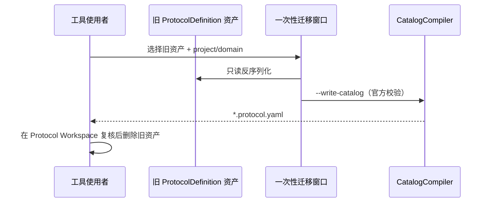

# Ability-Kit Protocol Editor 协议编辑器模块开发设计文档

> **【已冻结 / SUPERSEDED（2026-08）】**
> 本文档描述的 ScriptableObject 协议定义 + 代码生成双轨入口已被 **YAML Protocol Workspace** 取代
> （`Tools/AbilityKit/Framework/Protocol/Protocol Workspace`，设计见仓库 `Docs/design/` 协议目录）。
> 冻结内容：
>
> - `ProtocolDefinition` 的 `[CreateAssetMenu]` 已移除，类型标记 `[Obsolete]`，仅保留**只读**能力供既有 `.asset` 反序列化与一次性迁移。
> - `Editor/ProtocolEditor/Generator/` 代码生成器（OpCodes / MemoryPack DTO / 快照路由胶水 / codec backend stub）与 `SnapshotRoutingImporterWindow`、`CSharpTypeNameUtility` 已**删除**；本包不再自行生成任何 C# 代码，MemoryPack DTO 与 opcode 一律由官方 compiler 导出。
> - 唯一保留入口：`Migrate Legacy ProtocolDefinition (one-time)` 迁移窗口，只读取旧资产并经 `AbilityKit.Protocol.CatalogCompiler` 写成 YAML catalog。
>
> 以下原文仅作历史背景保留。

---

## 一、设计理念（历史）

Protocol Editor 是协议工具层，不参与运行时消息收发。它把协议定义集中到 `ProtocolDefinition`，再生成 OpCode、协议类型声明、快照路由胶水和后端编解码 Stub。

这样可以让协议结构由资产驱动，减少手写重复代码，并让不同 codec 后端共用同一份定义。

> 冻结后：协议结构的唯一权威是仓库 `Protocols/` 下的 YAML catalog / wire schema，资产驱动路径已废弃。

---

## 二、模块边界（冻结后现状）

负责：

- 提供 YAML Protocol Workspace 编辑窗口（Catalog / Wire Schema / Export），复用 `AbilityKit.Protocol.CatalogCompiler`。
- 提供 `ProtocolDefinition` 只读 Schema（`[Obsolete]`，无 CreateAssetMenu）。
- 提供一次性迁移窗口：读取旧 `ProtocolDefinition` 资产 → 写 YAML catalog（走 compiler 校验）。

不再负责（已删除/冻结）：

- ~~根据定义生成 OpCode、协议类型和快照路由代码~~（Generator 目录已删除，禁止再生成 MemoryPack DTO / opcode）。
- ~~CustomBinary、Protobuf、Json backend 生成器扩展点~~（已删除）。
- ~~快照路由声明导入窗口~~（已删除）。

仍然不负责：

- 不在运行时加载协议资产。
- 不负责编译生成代码后的业务实现。
- 不负责 MemoryPack 或 Protobuf 运行库安装。
- 不负责网络连接和消息派发。

---

## 三、目录结构（冻结后）

| 路径 | 职责 |
|------|------|
| `Editor/ProtocolEditor/Schema/ProtocolDefinition.cs` | 旧协议定义资产（`[Obsolete]` 只读，仅供迁移读取） |
| `Editor/ProtocolEditor/UI/ProtocolEditorWindow.cs` | YAML Protocol Workspace 窗口 + compiler 桥接 + 一次性迁移窗口 |

已删除：`Editor/ProtocolEditor/Generator/`（全部生成器）、`UI/SnapshotRoutingImporterWindow.cs`、`UI/CSharpTypeNameUtility.cs`。

---

## 四、核心类型（历史 + 冻结标记）

### 4.1 ProtocolDefinition（已冻结）

`ProtocolDefinition` 是 ScriptableObject，包含 `RegistryId`、`Domain`、`Messages`；每条 `MessageDefinition` 含 `Name`、`OpCode`、`Channel`（SnapshotDecoder/SnapshotCmdHandler/SnapshotPipelineStage）、`PayloadTypeName`、`PipelineOrder`、`Backend`（CustomBinary/Protobuf/Json）。

字段保持不变以兼容既有资产反序列化；新建资产入口已移除。

### 4.2 一次性迁移映射（现行）

`LegacyProtocolDefinitionMigrationWindow` 将旧定义映射为 YAML catalog 消息：

| 旧字段 | YAML catalog 字段 |
|------|------|
| `Channel = SnapshotDecoder` | `direction: s2c`，`kind: push` |
| `Channel = SnapshotCmdHandler` | `direction: c2s`，`kind: request` |
| `Channel = SnapshotPipelineStage` | `direction: bidirectional`，`kind: event` |
| `Backend = CustomBinary` | `codec: custom-binary` |
| `Backend = Protobuf` | `codec: protobuf` |
| `Backend = Json` | `codec: memorypack`（无对应 codec，迁移后需人工复核） |
| `OpCode <= 0` / 空名称 / 空负载类型 | 跳过并在窗口状态中列出 |

写入走 `ProtocolCompilerBridge.WriteCatalog` → `AbilityKit.Protocol.CatalogCompiler --write-catalog`，与工作台同一份校验（catalog id / project id / domain / revision / codec 白名单 / opcode 非零等 AKP 诊断）。

### 4.3 ProtocolCodeGenerator（已删除）

原 `GenerateOpCodes` / `GenerateProtocolTypesWithAttributes`（`[MemoryPackable]` DTO）/ `GenerateSnapshotRoutingGlue` / `GenerateCodecBackendStubs` 等入口连同 `CodecBackendGenerators` 注册表整体删除。静态守护测试见 `src/AbilityKit.Protocol.Tests/ProtocolEditorLegacyTrackFreezeTests.cs`。

---

## 五、迁移流程（现行）

---

## 六、注意事项

- 旧资产迁移后应删除 `.asset`，避免双源并存；`ProtocolDefinition` 不会再获得新能力。
- 迁移窗口不做任何 C# 代码生成；MemoryPack DTO / opcode 只能来自 Protocol Workspace 的官方导出（compiler `--export-memorypack`）。
- `SanitizeIdentifier` 等标识符清洗逻辑随生成器一并删除，协议命名规范改由 catalog 校验（AKP033 等）承担。

---

## 七、后续演进

- ~~增加协议定义校验：重复 OpCode、空 PayloadType、非法类型名~~（已由 catalog 校验承接）。
- ~~根据 backend 控制是否生成 MemoryPack using/attribute~~（生成器已删除）。
- ~~为生成产物增加版本戳和源定义路径~~（由 compiler 导出 manifest 承接）。
- 待所有旧 `.asset` 迁移完毕后，可整体删除 `Schema/ProtocolDefinition.cs` 与迁移窗口。

---

*文档版本：2.0（冻结版）*
*最后更新：2026-08-24*
